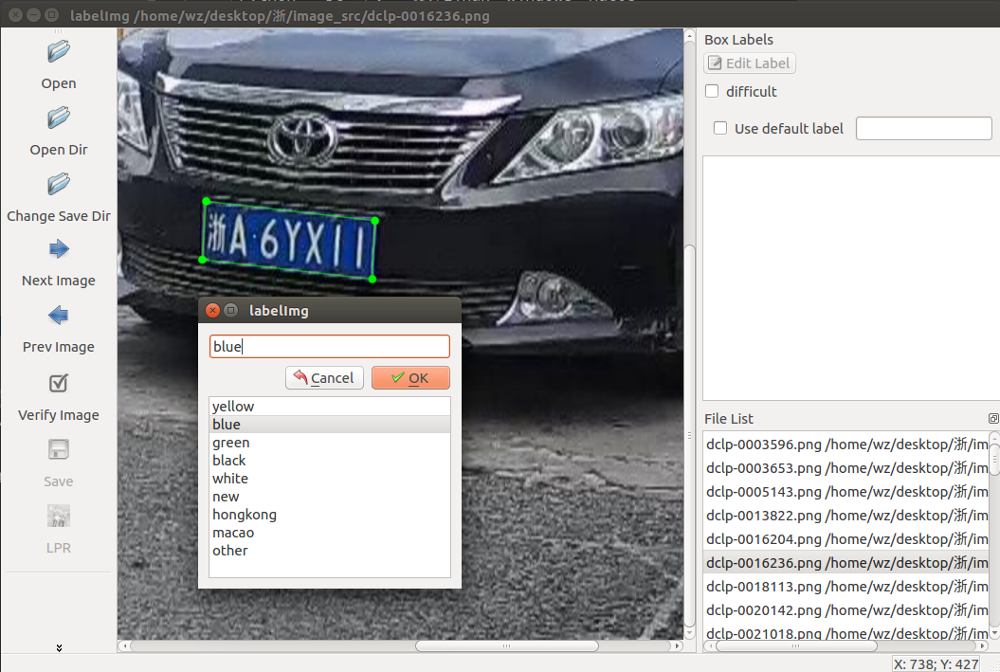

LabelImg
========

基于LabelImg修改而来的任意四边形目标标注软件。

Python + Qt 编写， 支持Linux、Windows、MacOS。

标注结果以json格式保存。

同时针对车牌标注问题，有以下主要改进：
1. 最大化标注效率，双击下一张直接开始标注。
2. 标注好区域后，会自动尝试识别车牌颜色（极端情况可能会识别错误）。

安装方式
------------------

## Linux/Ubuntu/Mac
 requires at least [Python 2.6](https://www.python.org/getit)__ and has been tested with [PyQt 4.8](https://www.riverbankcomputing.com/software/pyqt/intro)

### Ubuntu Linux
#### Python 2 + Qt4

    sudo apt-get install pyqt4-dev-tools
    sudo pip install lxml
    make qt4py2
    python labelImg.py
    python labelImg.py [IMAGE_PATH] [PRE-DEFINED CLASS FILE]

#### Python 3 + Qt5

    sudo apt-get install pyqt5-dev-tools
    sudo pip3 install lxml
    make qt5py3
    python3 labelImg.py
    python3 labelImg.py [IMAGE_PATH] [PRE-DEFINED CLASS FILE]

### macOS
#### Python 2 + Qt4

    brew install qt qt4
    brew install libxml2
    make qt4py2
    python labelImg.py
    python  labelImg.py [IMAGE_PATH] [PRE-DEFINED CLASS FILE]

#### Python 3 + Qt5 (Works on macOS High Sierra)

    brew install qt  # will install qt-5.x.x
    brew install libxml2
    make qt5py3
    python labelImg.py
    python  labelImg.py [IMAGE_PATH] [PRE-DEFINED CLASS FILE]

**NEW** Python 3 Virtualenv + Binary  
This avoids a lot of the QT / Python version issues,
and gives you a nice .app file with a new SVG Icon
in your /Applications folder. You can consider this script: build-tools/build-for-macos.sh

    
    
    brew install python3
    pip install pipenv
    pipenv --three
    pipenv shell
    pip install py2app
    pip install PyQt5 lxml
    make qt5py3
    rm -rf build dist
    python setup.py py2app -A
    mv "dist/labelImg.app" /Applications

### Windows

Download and setup `Python 2.6 or
later <https://www.python.org/downloads/windows/>`__,
`PyQt4 <https://www.riverbankcomputing.com/software/pyqt/download>`__
and `install lxml <http://lxml.de/installation.html>`__.

Open cmd and go to the `labelImg <#labelimg>`__ directory

    pyrcc4 -o resources.py resources.qrc
    python labelImg.py
    python labelImg.py [IMAGE_PATH] [PRE-DEFINED CLASS FILE]
    
#### Windows + Anaconda

Download and install `Anaconda <https://www.anaconda.com/download/#download>`__ (Python 3+)

Open the Anaconda Prompt and go to the `labelImg <#labelimg>`__ directory

    conda install pyqt=5
    pyrcc5 -o resources.py resources.qrc
    python labelImg.py
    python labelImg.py [IMAGE_PATH] [PRE-DEFINED CLASS FILE]

License
~~~~~~~
`Free software: MIT license <https://github.com/tzutalin/labelImg/blob/master/LICENSE>`_

Citation: Tzutalin. LabelImg. Git code (2015). https://github.com/tzutalin/labelImg

Related
~~~~~~~

1. `ImageNet Utils <https://github.com/tzutalin/ImageNet_Utils>`__ to
   download image, create a label text for machine learning, etc
2. `Use Docker to run labelImg <https://hub.docker.com/r/tzutalin/py2qt4>`__
3. `Generating the PASCAL VOC TFRecord files <https://github.com/tensorflow/models/blob/4f32535fe7040bb1e429ad0e3c948a492a89482d/research/object_detection/g3doc/preparing_inputs.md#generating-the-pascal-voc-tfrecord-files>`__
4. `App Icon based on Icon by Nick Roach (GPL)` <https://www.elegantthemes.com/> <https://www.iconfinder.com/icons/1054978/shop_tag_icon> __

